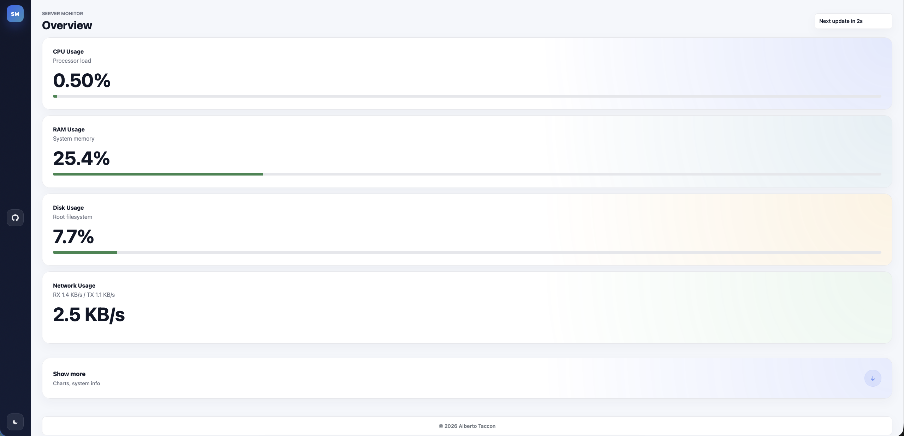
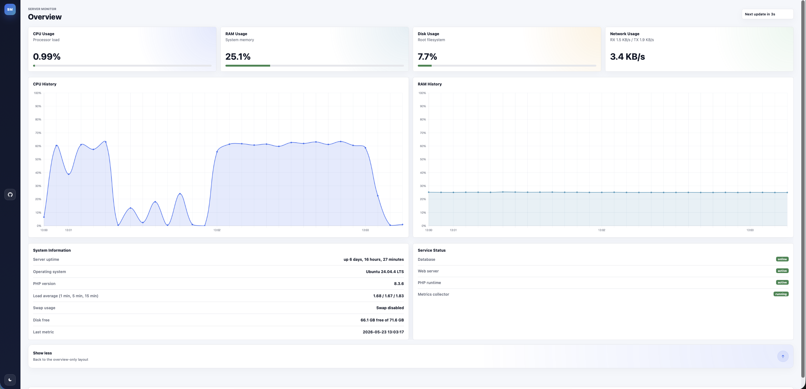
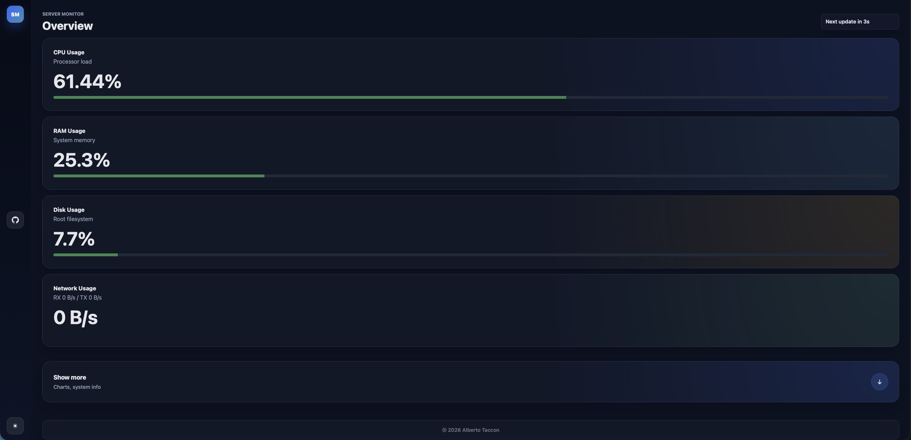
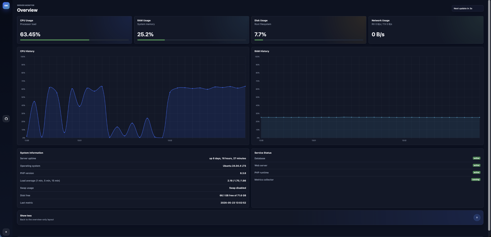

# Server Monitor

Lightweight PHP 8.3 dashboard for monitoring a Linux VPS without a framework.

`Server Monitor` shows the current health of a server through a public dashboard with live refresh, historical charts, dark mode, and a minimal responsive UI.

## Preview

### Light Theme




### Dark Theme




## Features

- Public dashboard with no login
- CPU, RAM, and disk usage cards backed by stored metrics
- Live network throughput card (`RX` / `TX` per second)
- CPU and RAM history charts
- System information, uptime, and PHP version
- Database connectivity and configurable service status checks
- Dark mode with saved preference
- Responsive layout for desktop and mobile
- JSON metrics endpoint for auto-refresh

## Stack

- PHP 8.3
- MariaDB / MySQL
- PDO
- Bootstrap 5
- Chart.js
- Linux `/proc`
- cron or systemd timer

No Laravel, no ORM, no framework.

## How It Works

1. `scripts/collect_metrics.php` collects `cpu_usage`, `ram_usage`, and `disk_usage`.
2. Those metrics are stored in MariaDB / MySQL for the dashboard history.
3. `app/metrics.php` builds the cards and chart payload used by the UI and by `/api/metrics.php`.
4. Network throughput is sampled live from `/proc/net/dev`, so it is shown in real time and is not stored in the database.

## Project Structure

```text
server-monitor/
├── app/
│   ├── config.php
│   ├── database.php
│   ├── helpers.php
│   ├── metrics.php
│   └── server_info.php
├── database/
│   └── schema.sql
├── public/
│   ├── api/
│   │   └── metrics.php
│   ├── assets/
│   │   ├── css/app.css
│   │   └── js/dashboard.js
│   ├── dashboard.php
│   └── index.php
├── scripts/
│   └── collect_metrics.php
├── .env
├── .env.example
├── LICENSE
└── README.md
```

## Requirements

- Linux server or VPS
- PHP 8.3 with `pdo_mysql`
- MariaDB or MySQL
- nginx or Apache
- cron or systemd

## Quick Start

Install the required packages on Ubuntu / Debian:

```bash
sudo apt update
sudo apt install -y git nginx mariadb-server php8.3 php8.3-fpm php8.3-mysql cron
sudo systemctl enable --now nginx mariadb php8.3-fpm cron
```

Clone the project:

```bash
cd /var/www
git clone https://github.com/alberto-taccon/server-monitor.git server-monitor
cd server-monitor
```


Create the database and import the schema:

```sql
CREATE DATABASE server_monitor CHARACTER SET utf8mb4 COLLATE utf8mb4_unicode_ci;
CREATE USER 'server_monitor'@'localhost' IDENTIFIED BY 'change_me';
GRANT ALL PRIVILEGES ON server_monitor.* TO 'server_monitor'@'localhost';
FLUSH PRIVILEGES;
```

```bash
mysql -u server_monitor -p server_monitor < database/schema.sql
```

Copy `.env.example` to `.env` and update the database values:

```bash
cp .env.example .env
```

```env
DB_HOST=127.0.0.1
DB_PORT=3306
DB_DATABASE=server_monitor
DB_USERNAME=server_monitor
DB_PASSWORD=change_me

SERVICE_WEB=nginx|apache2|httpd
SERVICE_PHP=php8.3-fpm|php-fpm|php8.2-fpm|php8.1-fpm
SERVICE_COLLECTOR_ENABLED=true
SERVICE_COLLECTOR_LABEL=Metrics collector
SERVICE_COLLECTOR_STALE_AFTER=20
SERVICE_EXTRA=
```

Set recommended permissions:

```bash
sudo chown -R $USER:www-data /var/www/server-monitor
sudo find /var/www/server-monitor -type d -exec chmod 755 {} \;
sudo find /var/www/server-monitor -type f -exec chmod 644 {} \;
sudo chmod +x /var/www/server-monitor/scripts/collect_metrics.php
sudo chgrp www-data /var/www/server-monitor/.env
sudo chmod 640 /var/www/server-monitor/.env
```

These commands assume:

- the project is installed in `/var/www/server-monitor`
- your deploy user owns the repository
- the web server group is `www-data`

Run the dashboard locally:

```bash
php -S localhost:8000 -t public
```

Open:

```text
http://localhost:8000
```

## Metrics Collection

Run the collector manually:

```bash
php scripts/collect_metrics.php
```

The database stores:

- `recorded_at`
- `cpu_usage`
- `ram_usage`
- `disk_usage`

If `cron` is not installed yet:

```bash
sudo apt update
sudo apt install -y cron
sudo systemctl enable --now cron
```

Install the collector crontab for the current user:

```bash
crontab -l 2>/dev/null > /tmp/server-monitor-cron
cat <<'EOF' >> /tmp/server-monitor-cron
# BEGIN server-monitor-5s
* * * * * /usr/bin/php /var/www/server-monitor/scripts/collect_metrics.php
* * * * * sleep 5 && /usr/bin/php /var/www/server-monitor/scripts/collect_metrics.php
* * * * * sleep 10 && /usr/bin/php /var/www/server-monitor/scripts/collect_metrics.php
* * * * * sleep 15 && /usr/bin/php /var/www/server-monitor/scripts/collect_metrics.php
* * * * * sleep 20 && /usr/bin/php /var/www/server-monitor/scripts/collect_metrics.php
* * * * * sleep 25 && /usr/bin/php /var/www/server-monitor/scripts/collect_metrics.php
* * * * * sleep 30 && /usr/bin/php /var/www/server-monitor/scripts/collect_metrics.php
* * * * * sleep 35 && /usr/bin/php /var/www/server-monitor/scripts/collect_metrics.php
* * * * * sleep 40 && /usr/bin/php /var/www/server-monitor/scripts/collect_metrics.php
* * * * * sleep 45 && /usr/bin/php /var/www/server-monitor/scripts/collect_metrics.php
* * * * * sleep 50 && /usr/bin/php /var/www/server-monitor/scripts/collect_metrics.php
* * * * * sleep 55 && /usr/bin/php /var/www/server-monitor/scripts/collect_metrics.php
# END server-monitor-5s
EOF
crontab /tmp/server-monitor-cron
rm /tmp/server-monitor-cron
crontab -l
```

The installed block will look like this:

```cron
* * * * * /usr/bin/php /var/www/server-monitor/scripts/collect_metrics.php
* * * * * sleep 5 && /usr/bin/php /var/www/server-monitor/scripts/collect_metrics.php
* * * * * sleep 10 && /usr/bin/php /var/www/server-monitor/scripts/collect_metrics.php
* * * * * sleep 15 && /usr/bin/php /var/www/server-monitor/scripts/collect_metrics.php
* * * * * sleep 20 && /usr/bin/php /var/www/server-monitor/scripts/collect_metrics.php
* * * * * sleep 25 && /usr/bin/php /var/www/server-monitor/scripts/collect_metrics.php
* * * * * sleep 30 && /usr/bin/php /var/www/server-monitor/scripts/collect_metrics.php
* * * * * sleep 35 && /usr/bin/php /var/www/server-monitor/scripts/collect_metrics.php
* * * * * sleep 40 && /usr/bin/php /var/www/server-monitor/scripts/collect_metrics.php
* * * * * sleep 45 && /usr/bin/php /var/www/server-monitor/scripts/collect_metrics.php
* * * * * sleep 50 && /usr/bin/php /var/www/server-monitor/scripts/collect_metrics.php
* * * * * sleep 55 && /usr/bin/php /var/www/server-monitor/scripts/collect_metrics.php
```

The dashboard UI currently refreshes every `5s` through `$autoRefreshMs` in `public/dashboard.php`. If the collector runs less often, the page still refreshes, but the stored CPU/RAM/Disk values will update only when a new sample is written.

## Service Status Configuration

The `Service Status` panel is configurable through `.env`.

- `SERVICE_WEB` accepts one or more fallback service names separated by `|`
- `SERVICE_PHP` accepts one or more PHP-FPM service names separated by `|`
- `SERVICE_COLLECTOR_ENABLED` toggles the `Metrics collector` row
- `SERVICE_COLLECTOR_STALE_AFTER` marks the collector as stale if the latest database sample is older than the configured number of seconds
- `SERVICE_EXTRA` accepts comma-separated `Label=service1|service2` pairs

Example:

```env
SERVICE_WEB=apache2|httpd
SERVICE_PHP=php8.2-fpm|php-fpm
SERVICE_EXTRA=Database engine=mariadb|mysql,Redis=redis-server
```

## Deployment Example

```nginx
server {
    listen 80;
    server_name monitor.example.com;
    root /var/www/server-monitor/public;
    index index.php;

    location / {
        try_files $uri $uri/ /index.php?$query_string;
    }

    location ~ \.php$ {
        include snippets/fastcgi-php.conf;
        fastcgi_pass unix:/run/php/php8.3-fpm.sock;
    }

    location ~ /\. {
        deny all;
    }
}
```

Then:

```bash
sudo nginx -t
sudo systemctl reload nginx
```

## Security Notes

- The dashboard is public by design.
- Point the web root to `public`.
- Keep `.env` outside version control.
- Use HTTPS in production.
- If the dashboard should stay private, protect it at network or reverse-proxy level.

## License

MIT License.
